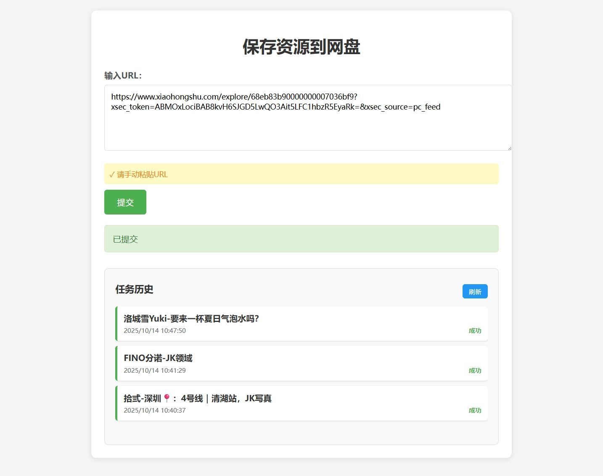
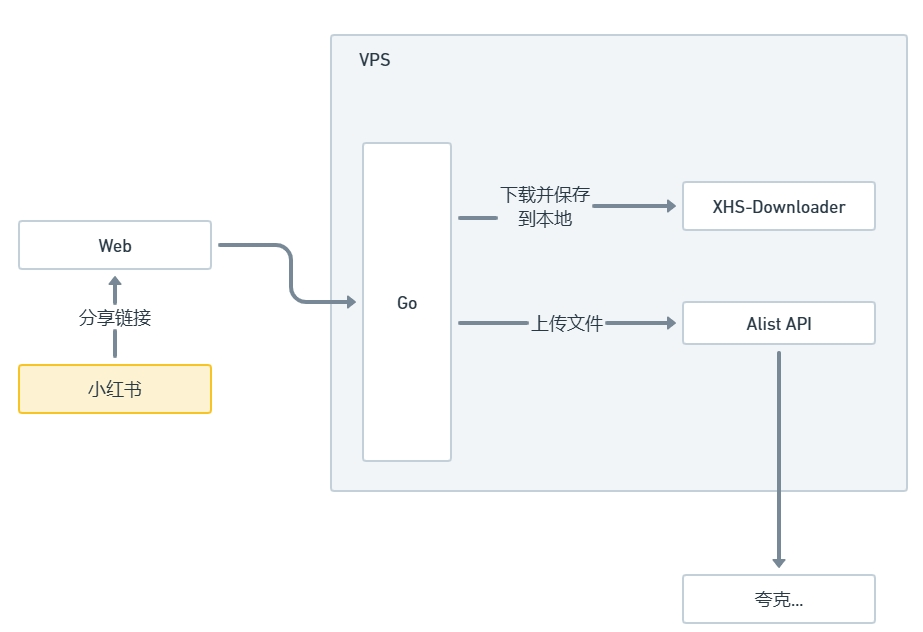

# 小红书收集器
> 90%代码由 [TRAE](https://www.trae.ai/) 协同开发完成

## 项目概述

小红书上有很多好东西，但是保存到手机占用空间，保存到网盘又要手动下载后上传，于是做了这个自动化下载和上传网盘的工具。

这是一个基于Golang和Gin框架开发的资源处理工具，主要用于从特定来源（如小红书）下载资源并上传到网盘（如AList）进行保存。工具提供了Web界面和API接口两种使用方式，方便用户操作。

[Alist](https://alistgo.com/zh/) 支持对接多种网盘，比如夸克网盘、百度网盘等。

## 功能特性

- **提取URL**：自动从输入内容中提取URL（支持小红书地址栏、分享链接）
- **资源下载**：自动抓取小红书图片、视频资源
- **网盘上传**：自动上传资源到 Alist 支持的网盘
- **Web界面**：提供用户友好的Web界面，自动读取剪贴板内容
- **配置管理**：支持通过配置文件自定义服务参数
- **系统服务**：提供systemd服务配置，便于后台稳定运行



## 日志

- **2025-10-13**：初始版本发布
- **2025-10-14**：页面增加显示任务列表和进度

其他

- [BUG] 下载器下过的资源不会重新下载
- [BUG] Alist任务有时候会上传失败
- [TODO] 定时清理下载目录

## 技术栈

- **后端**：Golang 1.24.2 + Gin框架
- **HTTP客户端**：Resty
- **配置管理**：ini配置文件
- **前端**：HTML5 + CSS3 + JavaScript


## 安装部署

### 1. 准备工作

- Go 1.24.2或更高版本
- [XHS-Downloader小红书资源下载器](https://github.com/JoeanAmier/XHS-Downloader)
- [Alist](https://alistgo.com/zh/)

### 2. 编译程序

```bash
# 克隆仓库（如果有）
# git clone <repository-url>

# 进入项目目录
cd /path/to/res_saver

# 获取依赖
go mod tidy

# 编译程序
go build -o res_saver
```

### 3. 配置文件

编辑`config.ini`文件，根据实际情况修改配置：

```ini
[server]
port = 9092

[xhs_downloader]
url = http://xxx/xhs/detail
download_dir = /root/res_saver/xhs_downloader_volume/Download

[alist]
url = http://xxx/api/fs/put
# 在Alist的设置-其他，最底下的token
token = xxx
# 上传路径，直接用文件夹名称，支持子文件夹
upload_path = /夸克
as_task = true

[cors]
allow_origin = *
allow_methods = POST, OPTIONS
allow_headers = Origin, Content-Type, Accept
```

### 4. 启动服务

#### 直接运行

```bash
./res_saver
```

#### 作为系统服务运行

1. 将`res_saver.service`复制到系统服务目录：
   ```bash
   sudo cp res_saver.service /etc/systemd/system/
   ```

2. 重载systemd配置：
   ```bash
   sudo systemctl daemon-reload
   ```

3. 启动服务：
   ```bash
   sudo systemctl start res_saver.service
   ```

4. 设置开机自启：
   ```bash
   sudo systemctl enable res_saver.service
   ```

5. 查看服务状态：
   ```bash
   sudo systemctl status res_saver.service
   ```

## 使用方法

### Web界面

1. 启动服务后，在浏览器中访问：`http://服务器IP:9092`
2. 页面会自动尝试读取剪贴板内容（需浏览器权限）
3. 确认URL无误后，点击「提交」按钮
4. 等待处理完成，查看结果信息

### API接口

可以直接调用`/api/process`接口：

```bash
curl -X POST http://服务器IP:9092/api/process \
  -H "Content-Type: application/json" \
  -d '{"message":{"text":"https://www.xiaohongshu.com/explore/作品ID"}}'
```

## URL格式支持

支持黏贴以下URL格式：
- `https://www.xiaohongshu.com/explore/作品ID?xsec_token=XXX`
- `https://www.xiaohongshu.com/discovery/item/作品ID?xsec_token=XXX`
- `https://www.xiaohongshu.com/user/profile/作者ID/作品ID?xsec_token=XXX`
- `https://xhslink.com/分享码`
